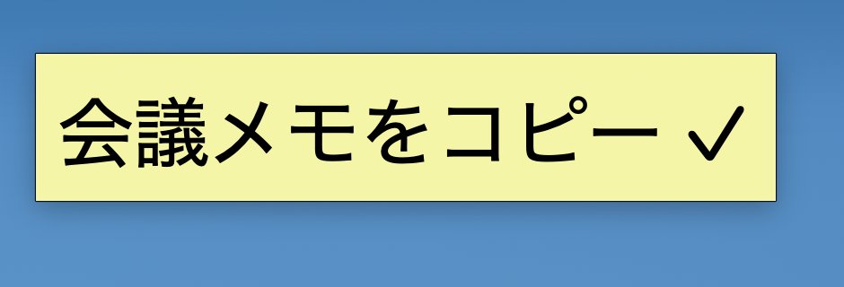
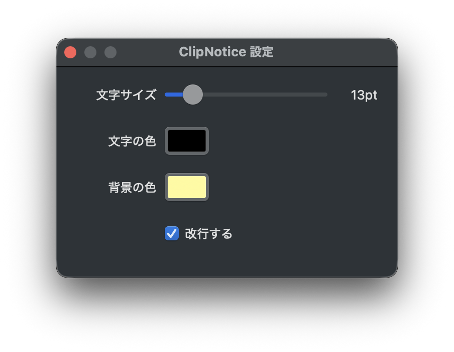

# ClipNotice

**Clipboard copy notifier — macOS & Windows, ambient, zero-UI.**

コピーした瞬間、画面の隅に付箋が表示される。3秒で消える。
Dockなし、メニューバーなし。確認のためにペーストする必要がなくなる。

**特に便利な場面:** Google Remote Desktop など複数PC間でコピペを往復するとき、「どのPCにコピーが届いているか」が付箋で一目でわかる。

> Differences from clipboard managers (Maccy, Clipy, Paste): ClipNotice stores **nothing**.
> No history. No hotkeys. Passive ambient notification only.
>
> **Especially useful with remote desktop tools** (Google Remote Desktop, etc.): instantly confirm which machine received your clipboard content — no need to paste-and-check.



---

## Install — macOS

### Homebrew (推奨)

```bash
brew tap tobisako/clipnotice
brew install clipnotice
clipnotice &
```

### Build from source

```bash
git clone https://github.com/tobisako/ClipNotice.git
cd ClipNotice/mac
bash build.sh release
.build/release/clipnotice &
```

**Requirements:** macOS 13+, Xcode

---

## Install — Windows

### Download EXE

[**Releases**](https://github.com/tobisako/ClipNotice/releases) から `clipnotice.exe` をダウンロードして実行。

**SmartScreen 警告が出た場合:**
1. 「詳細情報」をクリック
2. 「実行」をクリック

これは署名なし配布の場合に表示される Windows の警告です。コードは [オープンソース](https://github.com/tobisako/ClipNotice/tree/master/win) です。

**Requirements:** Windows 10/11、.NET 9 ランタイム（[Microsoft 公式](https://dotnet.microsoft.com/download/dotnet/9.0)からインストール可能）

---

## Usage

```
コピー → 左上に付箋表示 → 3秒後自動消去
クリック → 即時消去
右クリック → 設定 / Quit ClipNotice
```

---

## Settings

右クリック → **設定...** で変更可能（リアルタイムプレビュー付き）:



| 設定 | 内容 |
|------|------|
| 文字サイズ | 8〜48pt スライダー |
| 文字の色 | カラーピッカー |
| 背景の色 | カラーピッカー（デフォルト: 黄色） |
| 改行する | 長文の折り返し on/off |

---

## Auto-start at login

**macOS:** System Settings → General → Login Items → "+" → `.build/release/clipnotice`

**Windows:** `Win+R` → `shell:startup` → `clipnotice.exe` のショートカットを配置

---

## Repo structure

```
ClipNotice/
├── mac/          # Swift + AppKit (macOS)
│   ├── Sources/ClipNotice/
│   ├── Package.swift
│   └── build.sh
└── win/          # C# + WinForms (Windows)
    ├── ClipboardMonitor.cs
    ├── StickyForm.cs
    ├── SettingsForm.cs
    ├── Settings.cs
    └── ClipNotice.csproj
```

---

## Specs

| 項目 | macOS | Windows |
|------|-------|---------|
| 言語 | Swift 5.9 | C# / .NET 9 |
| UI | AppKit NSPanel | WinForms |
| 検知 | NSPasteboard.changeCount ポーリング | Clipboard API ポーリング |
| ポーリング間隔 | 0.5秒 | 0.5秒 |
| テキスト上限 | 300文字 | 300文字 |
| 対象 | 文字列のみ | 文字列のみ |
| OS | macOS 13+ | Windows 10/11 |
| 配布 | Homebrew (ソースビルド) | GitHub Releases (EXE) |

---

## License

MIT — see [LICENSE](LICENSE)
